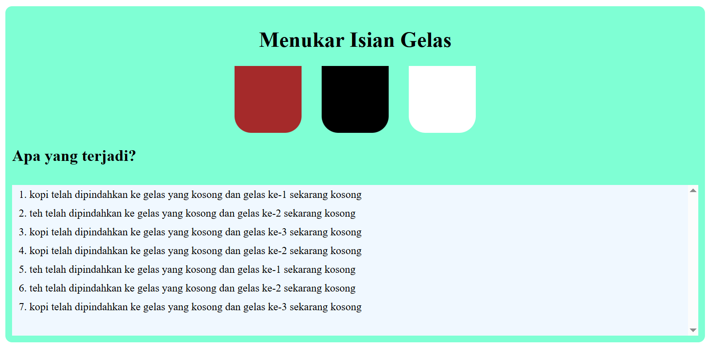

# Project DOM Switch

This project is for training only. This project implement DOM Event to switch content between container.

## Preview



## How to Run this Project

1. Clone this project
```
git clone https://github.com/mdavindarinaldy/fgo24-dom-switch.git
```
2. Run the project

## Dependencies
This project don't have any dependency

## Basic Information
This project is part of training in Kodacademy Bootcamp Batch 24 made by Muhammad Davinda Rinaldy